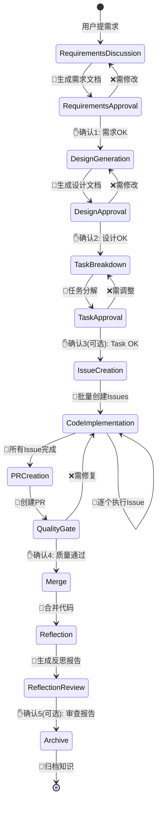
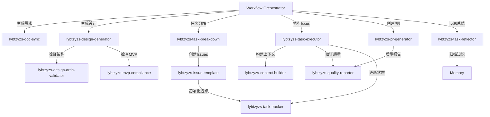

# LYBTZYZS 工作流自动化编排器

> **核心使命**: 将人工干预降到最低，让开发者专注于创造性工作，重复性任务全部自动化

## 核心能力

### 1. 状态机驱动的流程管理
- **10个标准状态**：需求讨论 → 需求确认 → 设计生成 → 设计确认 → 任务分解 → Issue创建 → 代码实现 → PR创建 → 质量门禁 → 反思归档
- **自动状态转换**：每个阶段完成后自动触发下一阶段
- **持久化状态**：保存到`.claude/cache/workflow-state.json`，支持断点恢复
- **并行状态**：支持多Issue并行开发（Phase 2）

### 2. Skills智能编排
- **13个Skills协同**：自动调用task-breakdown、issue-template、task-executor等
- **依赖管理**：确保Skills按正确顺序执行
- **参数传递**：自动传递上一阶段输出到下一阶段
- **错误处理**：Skill失败自动重试（最多3次）

### 3. 交互式确认机制
- **5个确认点**：需求、设计、Task（可选）、质量门禁、反思（可选）
- **智能提示**：每个确认点提供清晰的确认内容和选项
- **配置化策略**：支持required/auto/skip三种策略
- **超时提醒**：24小时无响应自动提醒

### 4. 质量保证机制
- **自动验证**：编译+测试+MVP合规+架构合规
- **质量门禁**：强制检查关键质量指标
- **技术债务追踪**：自动记录和分类技术债务
- **风险预警**：检测高风险变更并提示

### 5. 进度追踪与可视化
- **实时进度**：显示当前状态和预计完成时间
- **完成度计算**：已完成 / 总步骤
- **时间估算**：基于历史数据预测剩余时间
- **关键路径**：标识影响交付的关键任务

---

## 完整工作流程图



---

## 10个标准状态详解

### 状态1: RequirementsDiscussion（需求讨论）
**触发条件**：用户说"开始新需求：XXX"或"启动workflow"

**自动执行**：
1. 创建Spec名称（基于需求标题）
2. **调用lybtzyzs-requirements-generator生成需求文档**
   - 内部调用sequential-thinking深度分析需求
   - 内部调用lybtzyzs-doc-sync检查相关文档
   - 内部调用context7查询技术方案
   - 内部调用mvp-compliance检查技术栈
3. 生成需求讨论文档（`docs/explanation/architecture/{client|server|shared}/*-discussion.md`）

**输出**：
```markdown
## 需求讨论文档已生成

**文件**: docs/explanation/architecture/server/medicalcase-enhancement-discussion.md

**包含内容**:
- 需求背景和目标
- 关键业务规则（5条）
- 数据模型讨论
- 架构方案草图
- 待确认问题（3个）

**下一步**: 请审查需求文档，确认后进入设计阶段
```

**状态转换**：RequirementsDiscussion → RequirementsApproval（自动）

---

### 状态2: RequirementsApproval（需求确认）🔴 人工确认点1
**触发条件**：需求文档生成完成

**自动执行**：
1. 使用AskUserQuestion提示用户确认
2. 提供3个选项：
   - "确认需求，进入设计阶段"
   - "需要修改（说明修改内容）"
   - "查看详细需求文档"

**交互示例**：
```
Claude: 需求讨论文档已生成，请确认:

1. 需求理解是否准确？
   - 背景: 增强病案管理功能，支持草稿保存
   - 目标: 用户可保存未完成的病案，稍后继续编辑

2. 业务规则是否完整？
   - 规则1: 草稿仅保存到本地（不上传Server）
   - 规则2: 草稿自动保存（每30秒）
   - 规则3: 草稿保留7天后自动清理
   [查看完整规则]

3. 是否有遗漏的需求？

请选择:
A. 确认需求，进入设计阶段
B. 需要修改（请说明）
C. 查看完整需求文档
```

**状态转换**：
- 选A → DesignGeneration
- 选B → RequirementsDiscussion（回退）
- 选C → 展示文档 → 继续确认

**持久化状态**：
```json
{
  "specName": "medicalcase-enhancement",
  "currentState": "RequirementsApproval",
  "requirementsDoc": "docs/.../medicalcase-enhancement-discussion.md",
  "approval": {
    "status": "pending",
    "waitingSince": "2025-11-07T10:30:00Z"
  }
}
```

---

### 状态3: DesignGeneration（设计生成）
**触发条件**：需求确认通过

**自动执行**：
1. 读取确认后的需求文档
2. 调用lybtzyzs-design-generator生成设计文档
3. 调用lybtzyzs-design-arch-validator验证架构合规
4. 调用lybtzyzs-mvp-compliance检查MVP约束
5. 生成设计文档（`docs/explanation/*-design.md`）

**输出**：
```markdown
## 设计文档已生成

**文件**: docs/explanation/medicalcase-draft-design.md

**包含内容**:
- 架构设计（Client端: MVVM五层）
- API设计（无需新增API - 本地存储）
- 数据模型（DraftMedicalCase DTO）
- 技术方案（使用LiteDB本地数据库）
- Phase拆分（3个Phase，预计12-16小时）

**架构验证**: ✅ 通过
**MVP合规**: ✅ 通过（未使用Redis/CQRS等禁用技术）

**下一步**: 请审查设计文档，确认后进入任务分解
```

**状态转换**：DesignGeneration → DesignApproval（自动）

---

### 状态4: DesignApproval（设计确认）🔴 人工确认点2
**触发条件**：设计文档生成完成

**自动执行**：
1. 使用AskUserQuestion提示用户确认
2. 提供设计摘要和关键决策
3. 提供3个选项

**交互示例**：
```
Claude: 设计文档已生成，请确认:

## 架构设计
- 层级: Client端ViewModel + 本地存储（LiteDB）
- 无需Server端变更（草稿仅本地保存）

## 关键技术决策
1. 本地数据库: LiteDB（轻量级、无需额外配置）
2. 自动保存: 30秒定时器 + 数据变更检测
3. 清理策略: 后台任务，每日检查过期草稿

## Phase拆分
- Phase 1: DraftMedicalCase DTO + LiteDB配置（4h）
- Phase 2: ViewModel自动保存逻辑（6h）
- Phase 3: 草稿清理后台任务 + 测试（4h）
- 总计: 14小时（包含20% buffer）

## 风险提示
⚠️ LiteDB首次使用（学习曲线）
✅ 技术栈符合MVP约束

请选择:
A. 确认设计，进入任务分解
B. 需要调整（请说明）
C. 查看完整设计文档
```

**状态转换**：
- 选A → TaskBreakdown
- 选B → DesignGeneration（回退）
- 选C → 展示文档 → 继续确认

---

### 状态5: TaskBreakdown（任务分解）
**触发条件**：设计确认通过

**自动执行**：
1. 读取确认后的设计文档
2. 调用lybtzyzs-task-breakdown生成Task清单
3. 生成task文档（`docs/tasks/*-tasks.md`）

**输出**：
```markdown
## 任务分解完成

**文件**: docs/tasks/medicalcase-draft-tasks.md

**拆分结果**:
- 总任务数: 6个
- 总工作量: 14小时
- Phase数: 3个
- 依赖关系: Task 2 → Task 3 → Task 5

**任务清单预览**:
1. [Phase 1] 创建DraftMedicalCase DTO（2h）
2. [Phase 1] 配置LiteDB依赖和初始化（2h）
3. [Phase 2] 实现草稿保存ViewModel逻辑（3h）
4. [Phase 2] 实现30秒自动保存（2h）
5. [Phase 3] 实现草稿清理后台任务（2h）
6. [Phase 3] 单元测试和集成测试（3h）

**下一步**: 批量创建GitHub Issues
```

**状态转换**：TaskBreakdown → TaskApproval（自动或跳过）

---

### 状态6: TaskApproval（Task确认）🟡 可选确认点3
**触发条件**：任务分解完成

**配置策略**：
- **required**: 强制确认（适合首次使用）
- **auto**: 自动通过（默认）
- **skip**: 直接跳过

**交互示例**（如果配置为required）：
```
Claude: 任务已拆分为6个Issue，预计14小时。

是否需要查看Task清单？
A. 确认，直接创建Issues
B. 查看Task清单
C. 调整拆分粒度
```

**状态转换**：
- 选A或auto模式 → IssueCreation
- 选B → 展示清单 → 继续确认
- 选C → TaskBreakdown（回退）

---

### 状态7: IssueCreation（Issue创建）
**触发条件**：Task确认通过

**自动执行**：
1. 读取task文档
2. 调用lybtzyzs-issue-template批量创建Issues
3. 自动关联Epic（如果有）
4. 标注依赖关系（Depends on #XXXX）
5. 调用lybtzyzs-task-tracker初始化状态追踪

**输出**：
```markdown
## Issues创建完成

**Epic**: #1500（病案草稿功能）

**创建的Issues**:
- #1501: [Phase 1] 创建DraftMedicalCase DTO
- #1502: [Phase 1] 配置LiteDB依赖
- #1503: [Phase 2] 实现草稿保存逻辑（依赖#1502）
- #1504: [Phase 2] 实现自动保存（依赖#1503）
- #1505: [Phase 3] 实现草稿清理（依赖#1504）
- #1506: [Phase 3] 测试覆盖（依赖#1505）

**依赖关系已标注**: ✅
**任务追踪已初始化**: ✅

**下一步**: 开始执行Issue #1501
```

**状态转换**：IssueCreation → CodeImplementation（自动）

---

### 状态8: CodeImplementation（代码实现）
**触发条件**：Issues创建完成

**自动执行**：
1. 按依赖顺序逐个执行Issue
2. 对每个Issue调用lybtzyzs-task-executor：
   - 读取Issue详情
   - 构建上下文（lybtzyzs-context-builder）
   - 生成代码
   - 自动验证（编译+测试+合规）
   - 提交代码
3. 调用lybtzyzs-task-tracker更新Issue状态
4. 重复直到所有Issue完成

**输出**（每个Issue）：
```markdown
## Issue #1501执行完成

**任务**: 创建DraftMedicalCase DTO

**执行结果**:
- ✅ 代码生成: DraftMedicalCase.cs（80行）
- ✅ 编译通过
- ✅ 单元测试通过（3个测试）
- ✅ MVP合规
- ✅ 架构合规
- ✅ 代码已提交: commit 9a7b3c2

**下一步**: 执行Issue #1502
```

**进度追踪**：
```
进度: 2/6 Issues完成（33%）
预计剩余时间: 9小时
当前执行: Issue #1503
```

**状态转换**：
- 还有未完成Issue → CodeImplementation（循环）
- 所有Issue完成 → PRCreation

---

### 状态9: PRCreation（PR创建）
**触发条件**：所有Issue完成

**自动执行**：
1. 调用lybtzyzs-pr-generator生成PR
2. 自动关联所有相关Issues
3. 生成PR描述（Summary + Test Plan）
4. 调用lybtzyzs-quality-reporter生成质量报告
5. 创建PR到GitHub

**输出**：
```markdown
## PR已创建

**PR**: #150（病案草稿功能 - Epic #1500）

**包含Commits**: 6个
**关联Issues**: #1501-#1506（全部已完成）

**质量报告**:
- ✅ 编译通过（0 errors, 0 warnings）
- ✅ 测试通过（18/18 - 6个新测试 + 12个回归测试）
- ✅ 测试覆盖率：95%
- ✅ MVP合规检查通过
- ✅ 架构合规检查通过
- ⚠️ 技术债务：2个（已记录）
- 📊 代码质量评分：92分

**下一步**: 质量门禁检查
```

**状态转换**：PRCreation → QualityGate（自动）

---

### 状态10: QualityGate（质量门禁）🔴 人工确认点4
**触发条件**：PR创建完成

**自动执行**：
1. 聚合所有质量指标
2. 检查是否满足自动合并条件
3. 生成质量门禁报告
4. 使用AskUserQuestion提示确认

**交互示例**：
```
Claude: PR已创建，质量门禁检查:

## ✅ 通过项
- 编译: 0 errors, 0 warnings
- 测试: 18/18 通过
- 覆盖率: 95% (≥ 80%)
- MVP合规: 无违规
- 架构合规: 依赖方向正确
- 代码评分: 92分 (≥ 85分)

## ⚠️ 警告项
- 技术债务: 2个（低优先级）
  - TD-001: DraftMedicalCaseViewModel缺少Loading状态
  - TD-002: 测试数据清理逻辑重复

## 📋 技术债务详情
TD-001（中优先级）:
- 位置: DraftMedicalCaseViewModel.cs:SaveDraftAsync
- 问题: 保存草稿时未显示Loading状态
- 影响: 用户体验（保存延迟无反馈）
- 建议: 添加IsLoading属性和绑定
- 预计修复: 30分钟

TD-002（低优先级）:
- 位置: DraftTests.cs:SetUp方法
- 问题: 每个测试重复清理逻辑
- 影响: 代码重复（非功能性）
- 建议: 提取到BaseTestFixture
- 预计修复: 15分钟

## 决策选项
A. 批准合并（技术债务已记录，稍后处理）
B. 查看PR详情
C. 立即修复技术债务（预计45分钟）
D. 拒绝合并（说明原因）
```

**状态转换**：
- 选A → Merge
- 选B → 展示PR → 继续确认
- 选C → CodeImplementation（修复债务）
- 选D → CodeImplementation（回退修复）

**自动合并条件**（如果配置为auto且满足）：
```json
{
  "testsPass": true,
  "mvpCompliance": true,
  "archCompliance": true,
  "qualityScore": 92,  // ≥ 85
  "techDebtCount": 2,  // ≤ 3
  "criticalDebt": 0    // = 0
}
→ 自动合并（跳过确认）
```

---

### 状态11: Merge（合并代码）
**触发条件**：质量门禁通过

**自动执行**：
1. 调用GitHub API合并PR
2. 关闭所有相关Issues
3. 调用lybtzyzs-task-tracker更新Epic进度
4. 清理临时分支

**输出**：
```markdown
## PR已合并

**PR**: #150 → master
**关闭Issues**: #1501-#1506（6个）
**Epic进度**: #1500（100% - 所有子Issues完成）

**下一步**: 生成Epic反思报告
```

**状态转换**：Merge → Reflection（自动）

---

### 状态12: Reflection（反思总结）
**触发条件**：PR合并完成

**自动执行**：
1. 调用lybtzyzs-task-reflector生成Epic反思报告
2. 分析所有子Issue的执行情况
3. 识别技术债务、最佳实践、反模式
4. 提取候选ADR
5. 生成反思报告

**输出**：
```markdown
## Epic反思报告已生成

**Epic**: #1500（病案草稿功能）

**执行总结**:
- 完成Issues: 6个
- 总耗时: 13.5小时（预估14h，偏差-4%）
- 质量评分: 92分
- 技术债务: 2个（已记录）

**做得好的地方**:
1. Phase拆分合理（依赖清晰，无阻塞）
2. LiteDB集成顺利（首次使用仅花费30分钟学习）
3. 测试覆盖率高（95%）

**可改进的地方**:
1. ViewModel缺少Loading状态（UX问题）
2. 测试代码重复（需重构）
3. 工作量估算略高（-4%偏差可接受）

**学习要点**:
1. LiteDB配置最佳实践（已归档memory）
2. 自动保存定时器模式（已归档memory）

**候选ADR**:
1. ADR-012: 本地草稿存储方案（LiteDB vs SQLite）

**下一步**: 审查反思报告（可选）
```

**状态转换**：Reflection → ReflectionReview（自动或跳过）

---

### 状态13: ReflectionReview（反思审查）🟡 可选确认点5
**触发条件**：反思报告生成完成

**配置策略**：
- **required**: 强制确认（适合识别到ADR时）
- **auto**: 自动归档（默认）
- **skip**: 直接跳过

**交互示例**（如果配置为required或识别到ADR）：
```
Claude: Epic反思报告已生成，发现候选ADR：

## 候选ADR
ADR-012: 本地草稿存储方案（LiteDB vs SQLite）

**背景**: 需要本地数据库存储草稿
**决策**: 采用LiteDB（轻量级、零配置）
**理由**:
- SQLite需要额外配置和驱动
- LiteDB纯C#实现，集成简单
- 性能满足草稿存储需求（<100条记录）

是否创建ADR文档？
A. 创建ADR并归档（推荐）
B. 跳过ADR，仅归档反思报告
C. 查看完整反思报告
```

**状态转换**：
- 选A → Archive（创建ADR）
- 选B或auto模式 → Archive（仅归档）
- 选C → 展示报告 → 继续确认

---

### 状态14: Archive（知识归档）
**触发条件**：反思审查完成

**自动执行**：
1. 归档反思报告到docs/reports/reflections/
2. 创建ADR（如果选择）
3. 保存最佳实践到memory
4. 更新文档索引
5. 清理工作流状态文件

**输出**：
```markdown
## 知识已归档

**反思报告**: docs/reports/reflections/epic-1500-reflection.md
**ADR**: docs/explanation/architecture/client/adr/ADR-012-local-draft-storage.md（已创建）
**Memory文件**:
- .serena/memories/pattern-litedb-config.md
- .serena/memories/pattern-auto-save-timer.md

**技术债务追踪**:
- Issue #1507: 修复DraftViewModel缺少Loading状态（已创建）
- Issue #1508: 重构测试代码重复（已创建）

**工作流完成**: ✅
```

**状态转换**：Archive → [完成]

---

## 持久化状态文件格式

**文件位置**: `.claude/cache/workflow-state.json`

```json
{
  "workflowId": "wf-medicalcase-draft-20251107",
  "specName": "medicalcase-draft",
  "epic": {
    "number": 1500,
    "title": "病案草稿功能",
    "url": "https://github.com/shouqitao/LYBTZYZS/issues/1500"
  },
  "currentState": "QualityGate",
  "stateHistory": [
    {
      "state": "RequirementsDiscussion",
      "enteredAt": "2025-11-07T09:00:00Z",
      "completedAt": "2025-11-07T09:15:00Z"
    },
    {
      "state": "RequirementsApproval",
      "enteredAt": "2025-11-07T09:15:00Z",
      "completedAt": "2025-11-07T09:20:00Z",
      "approvalBy": "user"
    },
    {
      "state": "DesignGeneration",
      "enteredAt": "2025-11-07T09:20:00Z",
      "completedAt": "2025-11-07T09:40:00Z"
    },
    {
      "state": "DesignApproval",
      "enteredAt": "2025-11-07T09:40:00Z",
      "completedAt": "2025-11-07T09:45:00Z",
      "approvalBy": "user"
    },
    {
      "state": "TaskBreakdown",
      "enteredAt": "2025-11-07T09:45:00Z",
      "completedAt": "2025-11-07T09:50:00Z"
    },
    {
      "state": "TaskApproval",
      "enteredAt": "2025-11-07T09:50:00Z",
      "completedAt": "2025-11-07T09:50:00Z",
      "approvalBy": "auto"
    },
    {
      "state": "IssueCreation",
      "enteredAt": "2025-11-07T09:50:00Z",
      "completedAt": "2025-11-07T10:00:00Z",
      "issues": [1501, 1502, 1503, 1504, 1505, 1506]
    },
    {
      "state": "CodeImplementation",
      "enteredAt": "2025-11-07T10:00:00Z",
      "completedAt": "2025-11-07T20:30:00Z",
      "completedIssues": [1501, 1502, 1503, 1504, 1505, 1506]
    },
    {
      "state": "PRCreation",
      "enteredAt": "2025-11-07T20:30:00Z",
      "completedAt": "2025-11-07T20:35:00Z",
      "pr": {
        "number": 150,
        "url": "https://github.com/shouqitao/LYBTZYZS/pull/150"
      }
    },
    {
      "state": "QualityGate",
      "enteredAt": "2025-11-07T20:35:00Z",
      "status": "pending"
    }
  ],
  "artifacts": {
    "requirementsDoc": "docs/explanation/architecture/server/medicalcase-draft-discussion.md",
    "designDoc": "docs/explanation/medicalcase-draft-design.md",
    "taskDoc": "docs/tasks/medicalcase-draft-tasks.md",
    "issues": [1501, 1502, 1503, 1504, 1505, 1506],
    "pr": 150
  },
  "metrics": {
    "startedAt": "2025-11-07T09:00:00Z",
    "estimatedCompletion": "2025-11-07T21:00:00Z",
    "actualHours": 13.5,
    "estimatedHours": 14,
    "qualityScore": 92,
    "techDebt": 2
  },
  "config": {
    "requirementsApproval": "required",
    "designApproval": "required",
    "taskApproval": "auto",
    "qualityGateApproval": "required",
    "reflectionReviewApproval": "auto"
  }
}
```

---

## 配置文件

**文件位置**: `.claude/config/workflow-orchestrator.json`

```json
{
  "approvalStrategy": {
    "requirementsApproval": "required",
    "designApproval": "required",
    "taskApproval": "auto",
    "qualityGateApproval": "required",
    "reflectionReviewApproval": "auto"
  },
  "autoMergeConditions": {
    "testsPass": true,
    "mvpCompliance": true,
    "archCompliance": true,
    "minQualityScore": 85,
    "maxTechDebt": 3,
    "maxCriticalDebt": 0
  },
  "retryStrategy": {
    "maxRetries": 3,
    "retryDelay": 60,
    "retryableErrors": [
      "CompilationError",
      "TestFailure",
      "NetworkTimeout"
    ]
  },
  "notifications": {
    "approvalTimeout": 86400,
    "progressUpdates": true,
    "errorAlerts": true
  },
  "parallelExecution": {
    "enabled": false,
    "maxConcurrentIssues": 1
  }
}
```

---

## 使用示例

### 示例1: 启动新需求（完整流程）

**用户输入**：
```
开始新需求：病案草稿保存功能
```

**Orchestrator执行**：
```
🤖 [00:00] 工作流已启动
📝 [00:02] 正在生成需求讨论文档...
📝 [00:15] 需求文档已生成

✋ [00:15] 【确认点1: 需求确认】
需求文档已生成，请确认:
1. 需求理解是否准确？
2. 业务规则是否完整？
3. 是否有遗漏的需求？

请选择: A. 确认 | B. 修改 | C. 查看详情
```

**用户确认**：`A`

```
🤖 [00:16] 需求已确认，进入设计阶段
📐 [00:18] 正在生成设计文档...
📐 [00:40] 设计文档已生成

✋ [00:40] 【确认点2: 设计确认】
设计文档已生成，包括:
- 架构: Client端MVVM + LiteDB
- Phase拆分: 3个Phase，14小时
- 技术: LiteDB首次使用

请选择: A. 确认 | B. 修改 | C. 查看详情
```

**用户确认**：`A`

```
🤖 [00:41] 设计已确认，进入任务分解
📋 [00:43] 正在拆分任务...
📋 [00:50] 任务分解完成（6个Issue，14小时）

🤖 [00:50] Task确认: auto模式，自动通过
🎯 [00:51] 正在批量创建Issues...
🎯 [01:00] Issues创建完成（#1501-#1506）

💻 [01:00] 开始执行Issue #1501...
💻 [02:30] Issue #1501完成 ✅
💻 [02:30] 开始执行Issue #1502...
💻 [04:00] Issue #1502完成 ✅
... [继续执行所有Issues]

💻 [11:30] 所有Issues执行完成（6/6）
📦 [11:31] 正在创建PR...
📦 [11:35] PR #150已创建

✋ [11:35] 【确认点4: 质量门禁】
PR已创建，质量报告:
- ✅ 编译通过
- ✅ 测试通过（18/18）
- ✅ MVP合规
- ✅ 架构合规
- ⚠️ 技术债务: 2个

请选择: A. 合并 | B. 查看PR | C. 修复债务 | D. 拒绝
```

**用户确认**：`A`

```
🤖 [11:36] PR已合并到master
🤖 [11:36] 关闭Issues: #1501-#1506
🤖 [11:37] Epic进度: 100%

🤔 [11:38] 正在生成反思报告...
🤔 [11:45] 反思报告已生成，识别到候选ADR

🤖 [11:45] 反思审查: auto模式，自动归档

💾 [11:46] 正在归档知识...
💾 [11:48] 知识已归档（ADR + Memory）

✅ [11:48] 工作流完成！
```

**总耗时**：11小时48分钟（用户主动时间：< 5分钟）

---

## Skills协同图



---

## 错误处理与重试

### 错误分类

| 错误类型 | 重试策略 | 处理方式 |
|---------|---------|---------|
| CompilationError | 最多3次 | 自动修复简单错误（using、命名空间） |
| TestFailure | 最多3次 | 分析失败原因，调整代码 |
| NetworkTimeout | 最多3次 | 指数退避重试 |
| MVPCompliance | 不重试 | 自动移除违规代码 |
| ArchCompliance | 不重试 | 标记Issue，人工修复 |
| UserRejection | 不重试 | 回退到上一状态 |

### 重试示例

```
💻 [10:30] 执行Issue #1503...
❌ [10:45] 编译失败: 缺少using System.Timers
🔄 [10:45] 自动修复: 添加using语句
💻 [10:46] 重试执行...
✅ [10:50] Issue #1503完成
```

---

## 进度追踪与可视化

### 实时进度显示

```
📊 工作流进度: 病案草稿功能

当前状态: CodeImplementation
进度: 4/6 Issues完成（67%）

已完成:
✅ #1501: 创建DraftMedicalCase DTO
✅ #1502: 配置LiteDB依赖
✅ #1503: 实现草稿保存逻辑
✅ #1504: 实现自动保存

进行中:
🔄 #1505: 实现草稿清理（预计30分钟）

待执行:
⏸️ #1506: 测试覆盖（预计3小时）

预计完成时间: 今天 15:30
已用时间: 10.5小时
剩余时间: 3.5小时
```

---

## 限制与注意事项

### 技术限制
1. **Claude Code基于对话**：无法24/7持续运行，需要用户保持会话
2. **状态持久化**：依赖文件系统，无法保证100%可靠性
3. **并行执行**：Phase 1仅支持串行，Phase 2增加并行能力

### 使用建议
1. **长时间任务**：建议分段执行（每段< 4小时）
2. **断点恢复**：工作流中断后，使用"恢复工作流: {specName}"继续
3. **配置调整**：首次使用建议所有确认点设为required，熟悉后改为auto

---

## 触发关键词

**启动新工作流**：
- "开始新需求：XXX"
- "启动workflow：XXX"
- "自动化开发：XXX"

**恢复工作流**：
- "恢复工作流：XXX"
- "继续执行：XXX"

**查看进度**：
- "工作流进度"
- "当前状态"
- "workflow status"

---

**最后更新**: 2025-11-07（v1.0 - 自动化编排引擎初版）
