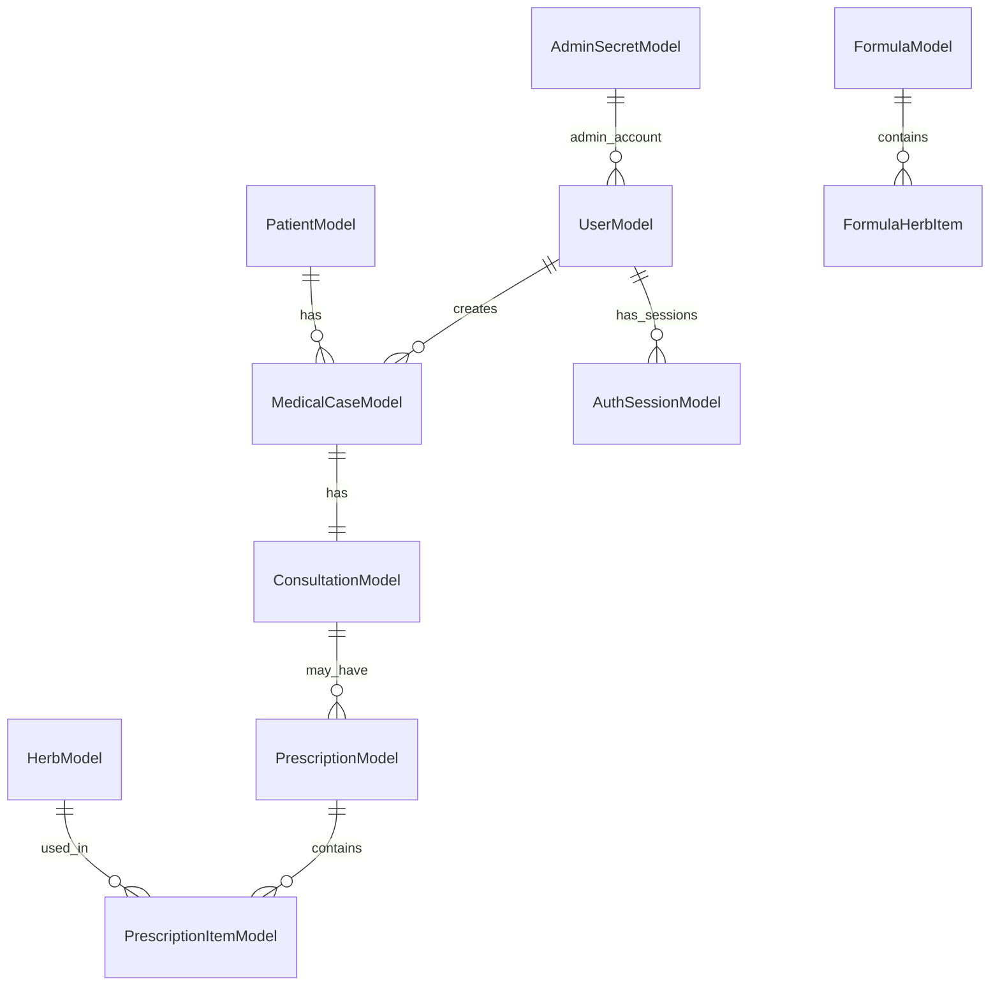

# 技术决策与架构原则 (Technical Decisions & Architecture Principles)

> **版本**: 1.0  
> **创建日期**: 2025-10-15  
> **来源**: 基于现有3.0文档整合  
> **维护**: 项目团队  
> **关联**: [Server模块设计标准](../../docs/architecture/server-module-design-standard.md), [Client端设计标准](../../docs/architecture/client/unified-design-standard.md)

## 🏗 总体架构

### 架构原则

1. **分层架构**: 严格遵循分层架构模式，确保职责分离
2. **模块化设计**: 采用模块化架构，支持独立开发和部署
3. **依赖注入**: 使用依赖注入容器管理组件生命周期
4. **接口抽象**: 通过接口定义组件间契约，提升可测试性

### 核心架构模式

```
┌─────────────────────────────────────────┐
│           Desktop Client                │
│    WPF MVVM + Prism Framework          │
│    Repository → HTTP API                │
└─────────────────┬───────────────────────┘
                  │ HTTP/REST
┌─────────────────▼───────────────────────┐
│            Web API Server               │
│    ASP.NET Core + Entity Framework     │
│    Controller → Service → Repository   │
└─────────────────┬───────────────────────┘
                  │ Database
┌─────────────────▼───────────────────────┐
│         SQL Server Database            │
│     Relational Data + Stored Procedures │
└─────────────────────────────────────────┘
```

## 🔧 技术栈选择

### 后端技术栈

| 组件 | 技术 | 版本 | 选择理由 |
|------|------|------|----------|
| **框架** | ASP.NET Core | 8.0 | 跨平台、高性能、生态丰富 |
| **数据库** | SQL Server | 2019+ | 企业级、高可靠、事务支持 |
| **ORM** | Entity Framework Core | 8.0 | 微软官方、功能完善、性能优秀 |
| **依赖注入** | Built-in DI Container | - | 轻量级、性能好、集成度高 |
| **认证授权** | JWT Bearer | - | 无状态、跨平台、易于扩展 |
| **API文档** | Swagger/OpenAPI | - | 自动生成、易于使用、标准化 |

### 前端技术栈

| 组件 | 技术 | 版本 | 选择理由 |
|------|------|------|----------|
| **框架** | WPF | .NET 8 | Windows原生、性能优秀、功能强大 |
| **MVVM框架** | Prism | 8.1 | 成熟稳定、功能完整、社区活跃 |
| **依赖注入** | DryIoc | - | 高性能、功能丰富、易于配置 |
| **HTTP客户端** | Refit | - | 类型安全、性能优秀、易于使用 |
| **测试框架** | xUnit | 2.4 | 功能强大、易于使用、生态丰富 |

### 开发工具链

| 工具 | 用途 | 选择理由 |
|------|------|----------|
| **IDE** | Visual Studio 2022 | 开发效率高、调试功能强、集成度好 |
| **版本控制** | Git + GitHub | 分布式、协作友好、CI/CD支持 |
| **构建工具** | MSBuild | 微软官方、功能完善、性能优秀 |
| **测试工具** | NUnit/xUnit + Moq | 功能强大、易于使用、生态丰富 |
| **代码分析** | StyleCop + Roslyn Analyzer | 静态分析、代码质量保证 |

## 📋 架构决策记录 (ADR)

### ADR-001: 分层架构模式

**决策**: 采用传统的三层架构模式 (Controller → Service → Repository)

**理由**:
- 适合中小型项目的复杂度
- 易于理解和维护
- 符合团队技术栈熟悉度
- 避免过度设计的复杂性

**状态**: 已接受，已实施

### ADR-002: 禁止CQRS模式

**决策**: 严格禁止使用CQRS模式

**理由**:
- 小型诊所系统无需读写分离的复杂性
- 三层架构已足够满足业务需求
- 避免过度工程导致的维护负担
- 保持代码简洁和可读性

**状态**: 已接受，已实施

### ADR-003: Repository模式标准化

**决策**: 统一Repository设计和实现标准

**理由**:
- 确保数据访问层的一致性
- 提升代码的可维护性和可测试性
- 减少重复代码和技术债务
- 便于团队协作和知识传递

**状态**: 已接受，已实施

### ADR-004: Service层统一设计

**决策**: Server端Service接口统一迁移至Shared层

**理由**:
- 避免接口定义的重复
- 提升接口的一致性和可维护性
- 支持跨模块的服务复用
- 便于接口版本管理和演进

**状态**: 已接受，已实施

### ADR-005: AutoMapper使用限制

**决策**: 限制AutoMapper的使用，优先使用手动映射

**理由**:
- 手动映射提供更好的性能和控制
- 避免运行时映射错误
- 提升代码的可读性和可调试性
- 减少技术栈的复杂性

**状态**: 已接受，正在实施

## 🔐 安全架构

### 双轨认证系统设计

**物理隔离的双轨架构**：
- **普通用户轨道**: Users表标准认证流程
  - 支持用户注册、密码重置、账户锁定
  - JWT Token认证，包含用户基本信息
  - RefreshToken机制，延长登录会话

- **超级管理员轨道**: AdminSecrets表物理隔离
  - 用户名从配置文件读取，数据库中只存储密码哈希
  - 专用隐藏端点 `/api/v1/auth/admin/login`
  - 用户名保护机制，防止用户名冲突

### JWT Token机制

1. **AccessToken**:
   - 有效期：2小时
   - 包含：用户ID、角色、权限信息
   - 用于API访问认证

2. **RefreshToken**:
   - 有效期：7天
   - 支持撤销机制
   - 用于Token续期更新

3. **Token验证**:
   - 支持GET和POST两种验证方式
   - 自动检测Token过期
   - 详细的错误信息返回

### 基于角色的授权

**角色权限矩阵**：
- **Admin**: 系统配置、用户管理、数据维护、审计日志
- **Doctor**: 患者管理、诊疗流程、处方管理、报表查看
- **权限控制粒度**：到具体的API端点和业务操作

### API安全防护

1. **认证要求**:
   - 所有API端点都需要认证（除登录相关端点外）
   - 支持Bearer Token认证
   - 隐藏敏感端点（如超级管理员登录）

2. **安全机制**:
   - 使用HTTPS加密传输
   - 实施API限流防护
   - 输入验证和SQL注入防护
   - 跨站请求伪造(CSRF)防护

### 数据安全

1. **敏感数据保护**:
   - 患者敏感信息加密存储
   - 数据库连接字符串加密
   - 配置文件敏感信息保护
   - 日志中敏感信息脱敏

2. **访问控制**:
   - 基于角色的数据访问控制
   - 审计日志记录所有关键操作
   - 数据备份和恢复策略
   - 定期安全审计

## 🏗️ 数据库架构设计

### 实体关系模型

**11个核心实体**：


### 数据库设计原则

1. **实体关系**:
   - 一病历一诊断：MedicalCase与Consultation一对一关系
   - 一医案多处方：MedicalCase与Prescription一对多关系
   - 处方与药材多对多：通过PrescriptionItem关联
   - 验方与药材多对多：通过FormulaHerbItem关联

2. **业务规则约束**:
   - 当天可改过期锁定：医案在当天可修改，过期后锁定
   - 医师权限：医生只能操作自己的医案
   - 管理员权限：管理员可以操作所有医案
   - 数据完整性：外键约束和业务规则验证

3. **索引策略**:
   - 患者手机号索引（唯一性验证）
   - 医案状态和创建时间索引（状态查询）
   - 用户ID和会话ID索引（用户会话管理）
   - 处方ID和药材ID索引（处方查询优化）

## 🎯 客户端架构设计

### WPF五层架构

**Client端实际架构**：
```
LYBT.Desktop/
├── Shell/                        # 启动层
│   ├── LYBT.Desktop.Shell/         # 应用程序壳
│   └── Views/                    # 主窗口和启动视图
├── Core_New/                      # 核心层
│   ├── LYBT.Desktop.Infrastructure/   # 基础设施层
│   │   ├── Commands/             # 命令系统
│   │   ├── Events/               # 事件系统
│   │   ├── Interfaces/           # 核心接口
│   │   └── Themes/               # 主题和样式
│   ├── LYBT.Desktop.Models/       # 模型层
│   │   ├── ViewModels/           # ViewModel基类
│   │   ├── Models/               # UI模型
│   │   └── Mappings/            # 映射配置
│   └── LYBT.Desktop.Services/     # 服务层
│       ├── Business/            # 业务服务
│       ├── Repositories/        # 仓储实现
│       ├── Http/               # HTTP客户端
│       └── Navigation/          # 导航服务
├── Modules/                      # 业务模块层
│   ├── LYBT.Desktop.Auth/          # 认证模块
│   ├── LYBT.Desktop.Patients/       # 患者管理模块
│   ├── LYBT.Desktop.MedicalCase/    # 医案管理模块
│   ├── LYBT.Desktop.Consultation/   # 诊疗模块
│   ├── LYBT.Desktop.Prescriptions/ # 处方管理模块
│   ├── LYBT.Desktop.Herbs/          # 药材管理模块
│   └── LYBT.Desktop.Formula/        # 验方管理模块
└── Workstations/                # 工作台层
    ├── LYBT.Desktop.ClinicalWorkstation/  # 诊疗工作台
    └── LYBT.Desktop.AdminWorkstation/     # 管理工作台
```

### MVVM架构实现

1. **ViewModel设计**:
   - 继承自ViewModelBase
   - 使用Prism的依赖注入
   - 实现INotifyPropertyChanged
   - 支持命令模式(ICommand)

2. **视图模型管理**:
   - 使用IEventAggregator进行模块间通信
   - 通过RegionManager管理视图导航
   - 实现对话框和窗口服务

3. **数据绑定**:
   - 双向数据绑定
   - 集值转换器(ValueConverter)
   - 验证规则(ValidationRule)

## 📊 性能架构

### 缓存策略

1. **内存缓存**:
   - 使用IMemoryCache缓存常用数据
   - 缓存患者基本信息、药材字典、用户会话
   - 设置合理的过期时间和清理策略

2. **查询优化**:
   - 使用Entity Framework的查询优化功能
   - 避免N+1查询问题
   - 实施延迟加载和预加载策略
   - 使用投影查询减少数据传输

3. **API优化**:
   - 统一的API响应格式
   - 分页查询和过滤
   - 适当的并发控制
   - 响应压缩和缓存

## 📊 性能架构

### 数据库优化

1. **索引策略**
   - 为常用查询字段创建索引
   - 定期分析和优化索引使用
   - 避免过度索引影响写入性能

2. **查询优化**
   - 使用Entity Framework的查询优化功能
   - 避免N+1查询问题
   - 实施查询缓存策略

### 缓存策略

1. **内存缓存**
   - 使用IMemoryCache缓存常用数据
   - 设置合理的过期时间
   - 实施缓存失效机制

2. **分布式缓存** (未来)
   - 考虑使用Redis作为分布式缓存
   - 支持多实例部署场景
   - 提升系统扩展性

## 🧪 测试架构

### 测试策略

1. **单元测试**
   - 覆盖率目标：80%以上
   - 使用xUnit + Moq框架
   - 专注于业务逻辑测试

2. **集成测试**
   - 测试组件间的交互
   - 使用内存数据库进行测试
   - 验证API端点的功能

3. **架构测试**
   - 验证架构约束和规则
   - 使用自定义测试规则
   - 确保代码质量标准

### 测试工具

- **单元测试**: xUnit, Moq, FluentAssertions
- **集成测试**: ASP.NET Core TestHost, InMemory Database
- **UI测试**: 可考虑引入UI自动化测试框架
- **性能测试**: 可考虑使用BenchmarkDotNet

## 🚀 部署架构

### 部署模式

1. **单机部署** (当前)
   - 简单易维护
   - 适合小型诊所
   - 成本效益高

2. **容器化部署** (未来)
   - 使用Docker容器化
   - 支持微服务架构演进
   - 提升部署灵活性

### 监控与日志

1. **应用监控**
   - 使用ASP.NET Core的健康检查功能
   - 集成应用性能监控(APM)
   - 实施告警机制

2. **日志管理**
   - 使用结构化日志记录
   - 集中化日志收集
   - 日志分析和查询

## 🔄 技术演进策略

### 技术债务管理

1. **识别技术债务**
   - 定期代码审查
   - 性能分析和监控
   - 团队反馈收集

2. **债务偿还计划**
   - 制定优先级排序
   - 分阶段实施优化
   - 平衡新功能开发和技术改进

### 技术栈升级

1. **依赖包管理**
   - 定期更新NuGet包
   - 关注安全漏洞修复
   - 测试兼容性

2. **框架升级**
   - 跟随.NET Core LTS版本
   - 提前规划升级路径
   - 充分测试验证

---

*本文档作为项目技术决策的权威指导，所有技术选型和架构设计都应遵循这些原则和决策。*